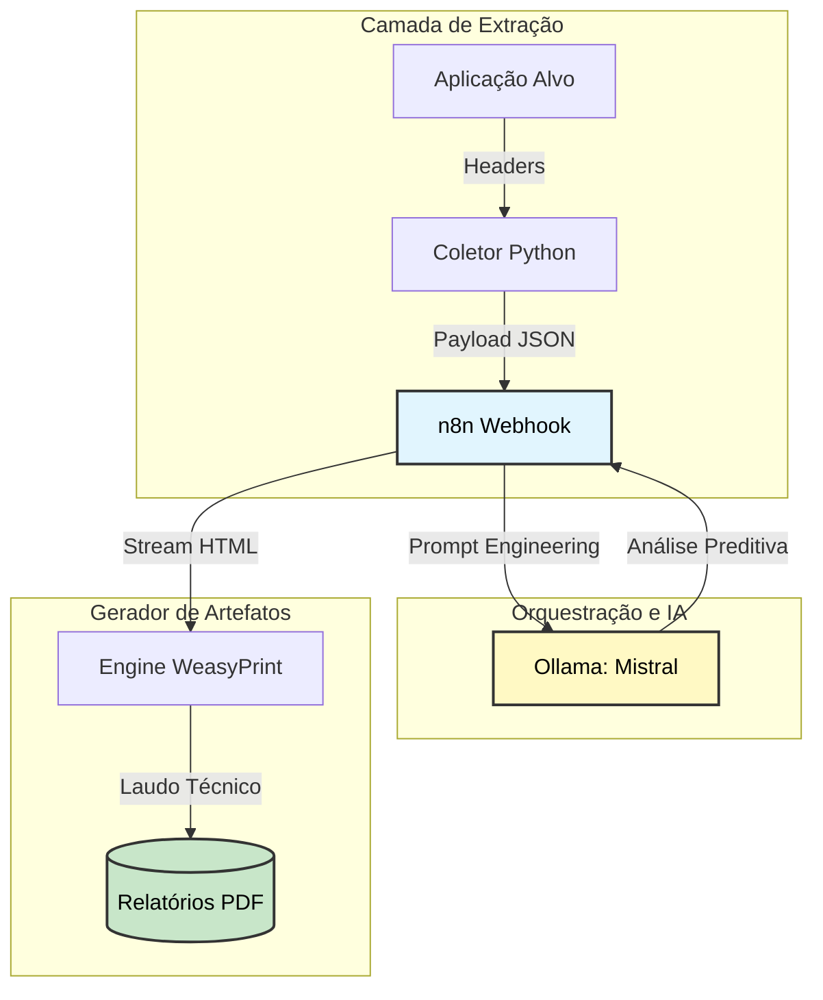

# 🛡️ Security Hub

> Hub de automação em AppSec projetado para **auditoria preditiva de cabeçalhos HTTP**. A infraestrutura integra Inteligência Artificial local (Mistral), orquestração modular via n8n e motores de renderização segura para a geração automática de laudos técnicos.

---

## 📐 Arquitetura de Fluxo de Dados



---

## 🧱 Stack de arquitetura

| Componente | Função |
|---|---|
| **n8n** (Orquestrador) | Hub central que gerencia o ciclo de vida dos dados, desde o recebimento via Webhook até a formatação Markdown |
| **Ollama** (Mistral) | Modelo de linguagem local responsável pela auditoria de segurança preditiva |
| **WeasyPrint** | Motor de renderização seguro que converte artefatos HTML em documentos PDF profissionais |
| **Python 3.10+** | Linguagem core do coletor de headers e do script de automação de setup |

---

## 🔒 Diretrizes de segurança — Defense in Depth

- **Isolamento de File System** — O acesso do orquestrador é restrito via variável `N8N_RESTRICT_FILE_ACCESS_TO`, prevenindo vulnerabilidades de Path Traversal no host.
- **Ambiente Confinado (Venv)** — Todas as dependências Python residem em um Virtual Environment isolado.
- **Sanitização de Entrada** — O fluxo do n8n atua como uma camada de sanitização antes que os dados cheguem ao modelo de IA.

---

## ⚙️ Endpoints e variáveis de ambiente

Configure o ambiente local utilizando as variáveis abaixo em seu arquivo `.env`:

```env
# Endpoints do Laboratório
N8N_WEBHOOK_URL=http://localhost:5678/webhook-test/security-hub
OLLAMA_API_BASE=http://localhost:11434

# Configurações de Escrita
N8N_RESTRICT_FILE_ACCESS_TO=/home/node/relatorios
```

---

## 🚀 Procedimento de subida de ambiente

**1. Provisionamento automático**
```bash
sudo ./setup.sh
```

**2. Inicialização da infra**
```bash
docker-compose up -d
```

**3. Execução do laboratório**
```bash
source venv/bin/activate
python3 coletor.py
```

---

## 📁 Estrutura do repositório

| Arquivo | Função |
|---|---|
| `coletor.py` | Extração de headers via Requests |
| `gerar_pdf.py` | Motor de renderização WeasyPrint |
| `setup.sh` | Automação de infra e TDD de ambiente |
| `simulador.html` | Interface visual de PoC (Ataques) |

---

## 🔄 Fluxo n8n — Exportação do Workflow

O arquivo abaixo representa o workflow completo do n8n e pode ser importado diretamente na interface do orquestrador em **Settings → Import Workflow**.

### Nós do Pipeline

| ID | Nome | Tipo | Função |
|---|---|---|---|
| `1` | Webhook - Receptor de headers | `n8n-nodes-base.webhook` | Recebe o payload JSON via `POST /security-hub` |
| `2` | Ollama - Auditoria preditiva | `n8n-nodes-base.httpRequest` | Envia os headers ao Mistral com prompt de auditoria |
| `3` | Execute - Gerador de laudo | `n8n-nodes-base.executeCommand` | Aciona `gerar_pdf.py` com a resposta da IA |

### Fluxo de execução

```
Webhook → Ollama (Mistral) → Execute (WeasyPrint)
```

> **Prompt de auditoria:** o nó do Ollama injeta os headers capturados dinamicamente, solicitando ao Mistral a geração de um laudo HTML com foco em `HSTS`, `CSP` e `X-Frame-Options`.

### JSON do Workflow

```json
{
  "name": "Security hub - Auditoria preditiva",
  "nodes": [
    {
      "parameters": {
        "httpMethod": "POST",
        "path": "security-hub",
        "responseMode": "lastNode",
        "options": {}
      },
      "id": "1",
      "name": "Webhook - Receptor de headers",
      "type": "n8n-nodes-base.webhook",
      "typeVersion": 1,
      "position": [250, 300]
    },
    {
      "parameters": {
        "method": "POST",
        "url": "http://localhost:11434/api/generate",
        "sendBody": true,
        "bodyParameters": {
          "parameters": [
            { "name": "model", "value": "mistral" },
            {
              "name": "prompt",
              "value": "={{ 'Analise os seguintes cabeçalhos HTTP de segurança e gere um laudo técnico em HTML. Foco em HSTS, CSP e X-Frame-Options: ' + JSON.stringify($node[\"Webhook - Receptor de headers\"].json.body.headers) }}"
            },
            { "name": "stream", "value": "false" }
          ]
        },
        "options": {}
      },
      "id": "2",
      "name": "Ollama - Auditoria preditiva",
      "type": "n8n-nodes-base.httpRequest",
      "typeVersion": 4.1,
      "position": [470, 300]
    },
    {
      "parameters": {
        "command": "={{ \"./venv/bin/python gerar_pdf.py '\" + $node[\"Ollama - Auditoria preditiva\"].json.response + \"'\" }}"
      },
      "id": "3",
      "name": "Execute - Gerador de laudo",
      "type": "n8n-nodes-base.executeCommand",
      "typeVersion": 1,
      "position": [690, 300]
    }
  ],
  "connections": {
    "Webhook - Receptor de headers": {
      "main": [[{ "node": "Ollama - Auditoria preditiva", "type": "main", "index": 0 }]]
    },
    "Ollama - Auditoria preditiva": {
      "main": [[{ "node": "Execute - Gerador de laudo", "type": "main", "index": 0 }]]
    }
  }
}
```

> **Como importar:** acesse o n8n → menu lateral → **Workflows → Import from JSON** → cole o conteúdo acima.
