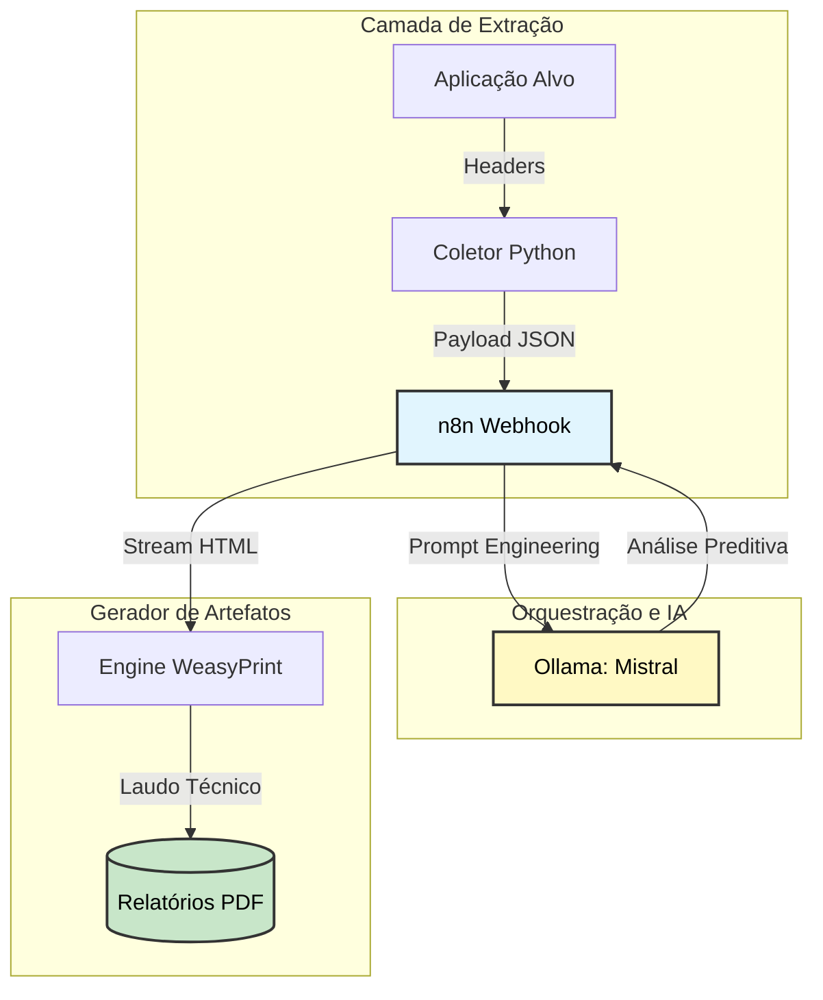

# 🛡️ Security Hub

> Hub de automação em AppSec projetado para **auditoria preditiva de cabeçalhos HTTP**. A infraestrutura integra Inteligência Artificial local (Mistral), orquestração modular via n8n e motores de renderização segura para a geração automática de laudos técnicos.

---

## 📐 Arquitetura de Fluxo de Dados



---

## 🧱 Stack de arquitetura

| Componente | Função |
|---|---|
| **n8n** (Orquestrador) | Hub central que gerencia o ciclo de vida dos dados, desde o recebimento via Webhook até a formatação Markdown |
| **Ollama** (Mistral) | Modelo de linguagem local responsável pela auditoria de segurança preditiva |
| **WeasyPrint** | Motor de renderização seguro que converte artefatos HTML em documentos PDF profissionais |
| **Python 3.10+** | Linguagem core do coletor de headers e do script de automação de setup |

---

## 🔒 Diretrizes de segurança — Defense in Depth

- **Isolamento de File System** — O acesso do orquestrador é restrito via variável `N8N_RESTRICT_FILE_ACCESS_TO`, prevenindo vulnerabilidades de Path Traversal no host.
- **Ambiente Confinado (Venv)** — Todas as dependências Python residem em um Virtual Environment isolado.
- **Sanitização de Entrada** — O fluxo do n8n atua como uma camada de sanitização antes que os dados cheguem ao modelo de IA.

---

## ⚙️ Endpoints e variáveis de ambiente

Configure o ambiente local utilizando as variáveis abaixo em seu arquivo `.env`:

```env
# Endpoints do Laboratório
N8N_WEBHOOK_URL=http://localhost:5678/webhook-test/security-hub
OLLAMA_API_BASE=http://localhost:11434

# Configurações de Escrita
N8N_RESTRICT_FILE_ACCESS_TO=/home/node/relatorios
```

---

## 🚀 Procedimento de subida de ambiente

**1. Provisionamento automático**
```bash
sudo ./setup.sh
```

**2. Inicialização da infra**
```bash
sudo docker-compose up -d
```

**3. Execução do laboratório**
```bash
source venv/bin/activate
sudo python3 coletor.py
```

**4. Visualizar o relatório gerado**
```bash
cd relatorios
sudo python3 -m http.server 8080
```

---

## 📁 Estrutura do repositório

| Arquivo | Função |
|---|---|
| `coletor.py` | Extração de headers via Requests |
| `gerar_pdf.py` | Motor de renderização WeasyPrint |
| `setup.sh` | Automação de infra e TDD de ambiente |
| `simulador.html` | Interface visual de PoC (Ataques) |

---

## 🔄 Fluxo n8n — Exportação do Workflow

O arquivo abaixo representa o workflow completo do n8n e pode ser importado diretamente na interface do orquestrador em **Settings → Import Workflow**.

### Nós do Pipeline

| ID | Nome | Tipo | Função |
|---|---|---|---|
| `1` | Webhook - Receptor de headers | `n8n-nodes-base.webhook` | Recebe o payload JSON via `POST /security-hub` |
| `2` | Ollama - Auditoria preditiva | `n8n-nodes-base.httpRequest` | Envia os headers ao Mistral com prompt de auditoria |
| `3` | Execute - Gerador de laudo | `n8n-nodes-base.executeCommand` | Aciona `gerar_pdf.py` com a resposta da IA |

### Fluxo de execução

```
Webhook → Ollama (Mistral) → Execute (WeasyPrint)
```

> **Prompt de auditoria:** o nó do Ollama injeta os headers capturados dinamicamente, solicitando ao Mistral a geração de um laudo HTML com foco em `HSTS`, `CSP` e `X-Frame-Options`.

### JSON do Workflow

```json
{
  "name": "Security Hub - Auditoria Final",
  "nodes": [
    {
      "parameters": {
        "httpMethod": "POST",
        "path": "coleta-headers",
        "options": {}
      },
      "id": "30d1a92b-415c-41b0-b4a3-73e4b498627b",
      "name": "Webhook",
      "type": "n8n-nodes-base.webhook",
      "typeVersion": 1,
      "position": [-256, -64]
    },
    {
      "parameters": {
        "method": "POST",
        "url": "http://172.23.105.14:11434/api/generate",
        "sendBody": true,
        "specifyBody": "json",
        "jsonBody": "={{ JSON.stringify({\n  \"model\": \"llama3.2\",\n  \"prompt\": \"[ANALISTA APPSEC]\\nSua tarefa é auditar os cabeçalhos HTTP recebidos abaixo.\\n\\nDADOS BRUTOS:\\n\" + JSON.stringify($json.body?.dados_brutos) + \"\\n\\nREGRAS:\\n1. Verifique: Strict-Transport-Security, Content-Security-Policy e X-Frame-Options.\\n2. Responda apenas o que está FALTANDO e o RISCO real.\\n3. Idioma: Português do Brasil.\\n4. Seja direto, sem introduções genéricas.\\n\\nRESULTADO DA AUDITORIA:\",\n  \"stream\": false\n}) }}",
        "options": {
          "timeout": 1200000
        }
      },
      "id": "afd8fab3-4319-48cc-b0a9-88589ac43607",
      "name": "HTTP Request",
      "type": "n8n-nodes-base.httpRequest",
      "typeVersion": 4.1,
      "position": [-32, -64]
    },
    {
      "parameters": {
        "mode": "markdownToHtml",
        "markdown": "={{ $json.response }}",
        "destinationKey": "html_bruto",
        "options": {}
      },
      "id": "95676062-e755-4746-ab4e-33ec16d182f6",
      "name": "Markdown",
      "type": "n8n-nodes-base.markdown",
      "typeVersion": 1,
      "position": [192, -64]
    },
    {
      "parameters": {
        "jsCode": "const textoHtml = $input.first().json.html_bruto;\n\nconst htmlFormatado = `\n<!DOCTYPE html>\n<html lang=\"pt-BR\">\n<head>\n    <meta charset=\"UTF-8\">\n    <style>\n        body { font-family: 'Segoe UI', sans-serif; line-height: 1.6; color: #2c3e50; margin: 40px auto; max-width: 900px; }\n        /* Estilo V: Primeira letra maiúscula apenas */\n        h1 { color: #1a252f; border-bottom: 2px solid #3498db; padding-bottom: 10px; text-transform: lowercase; }\n        h1::first-letter { text-transform: uppercase; }\n        h2, h3 { color: #2980b9; margin-top: 30px; }\n        .security-note { background: #fdf2f2; border-left: 5px solid #e74c3c; padding: 15px; border-radius: 4px; }\n    </style>\n</head>\n<body>\n    <h1>Relatório de análise de vulnerabilidades</h1>\n    <div class=\"security-note\">\n        ${textoHtml.replace(/\\n/g, '<br>')}\n    </div>\n</body>\n</html>\n`;\n\nconst buffer = Buffer.from(htmlFormatado, 'utf8');\n\nreturn {\n    json: { mensagem: \"Documento pronto para gravação.\" },\n    binary: {\n        data: {\n            data: buffer.toString('base64'),\n            mimeType: 'text/html',\n            fileName: 'relatorio_seguranca.html'\n        }\n    }\n};"
      },
      "id": "a6ff07a2-0a51-4036-9db3-e848162a8772",
      "name": "Code",
      "type": "n8n-nodes-base.code",
      "typeVersion": 2,
      "position": [416, -64]
    },
    {
      "parameters": {
        "operation": "write",
        "fileName": "/home/node/relatorios/relatorio_seguranca.html",
        "options": {}
      },
      "id": "36e699bc-362a-4a51-a020-baad6e112847",
      "name": "Read/Write Files from Disk",
      "type": "n8n-nodes-base.readWriteFile",
      "typeVersion": 1.1,
      "position": [624, -64]
    }
  ],
  "connections": {
    "Webhook": { "main": [[{ "node": "HTTP Request", "type": "main", "index": 0 }]] },
    "HTTP Request": { "main": [[{ "node": "Markdown", "type": "main", "index": 0 }]] },
    "Markdown": { "main": [[{ "node": "Code", "type": "main", "index": 0 }]] },
    "Code": { "main": [[{ "node": "Read/Write Files from Disk", "type": "main", "index": 0 }]] }
  }
}
```

> **Como importar:** acesse o n8n → menu lateral → **Workflows → Import from JSON** → cole o conteúdo acima.
